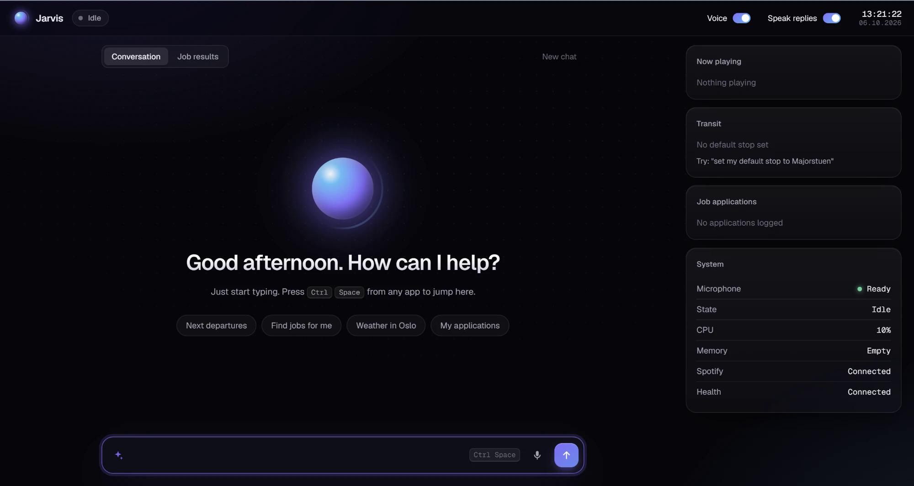

# Jarvis

A personal AI assistant you talk to **or type to**. It listens for "Hey Jarvis", transcribes your speech locally, and hands the request to Claude, which can call tools: Spotify, job search and application tracking, Norwegian public transit, and your Google Health (Fitbit) sleep and activity data. Replies appear in a local web UI and are spoken aloud.

It started as a voice assistant, but typing is faster than the voice round trip, so the UI is **keyboard-first**: a message box that is always focused, plus a global hotkey that jumps to it from any app. Voice stays available as an optional path.



## How it works

```
 microphone
     |
     v
 wake word ("Hey Jarvis", openWakeWord)            keyboard / web UI
     |                                                    |
     v                                                    | typed text skips
 record until you stop talking                            | everything on the left
 (energy threshold + WebRTC VAD)                          |
     |                                                    |
     v                                                    |
 faster-whisper, runs locally -> text + language          |
     |                                                    |
     +------------------------+---------------------------+
                              v
              Claude (claude-haiku-4-5) with tool calling
        web search | Spotify | jobs | transit | Google Health
                              |
                              v
                        reply text
                  |                      |
                  v                      v
           chat log in the UI     edge-tts (voice picked from the
                                   reply's language) -> speakers
```

| Piece | What it does |
|---|---|
| `jarvis.py` | The pipeline: wake-word loop, recording and silence detection, transcription, the Claude tool-calling loop, tool definitions, TTS. **Entry point.** |
| `web_app.py` | Flask server for the UI and its JSON API; Spotify and Google OAuth routes. Listens on `127.0.0.1:5000`. |
| `templates/`, `static/` | The single-page web UI (plain HTML, CSS and JavaScript, no build step). |
| `spotify_client.py` | Spotify Web API client (OAuth, playback control, now playing). |
| `google_health_client.py` | Google Health API client (OAuth, sleep, workouts, weekly rollup). |
| `entur_client.py` | Entur client (departures, journey planning, default stop). |
| `job_tracker.py` | Local JSON store for tracked job applications. |
| `hotkey.py` | Windows-wide `Ctrl+Space` hotkey that focuses the input box. |
| `wake_word_test.py` | Standalone microphone test for the wake word, without the rest of Jarvis. |

## Features

**Interaction**
- Type a message and press Enter; the reply shows immediately and is spoken (toggle **Speak replies** to make it text-only).
- `Ctrl+Space` from any application brings the Jarvis window forward and focuses the input. `Esc` cancels whatever Jarvis is doing, and typing while it is busy interrupts it.
- Say "Hey Jarvis", speak your command, and stop talking; Jarvis detects the end of speech and answers. After a spoken answer it listens for a follow-up for a few seconds without needing the wake word.
- A **Voice** toggle turns wake-word listening off entirely and releases the microphone. A push-to-talk button works even then.
- Conversation memory for the current session, cleared by **New chat** or after 5 minutes of inactivity.
- English and Norwegian are the languages I have tested. The voice is chosen from the language of the reply, so a Norwegian answer to a typed message is read by a Norwegian voice. Urdu is wired up (language detection and an Urdu voice) but has had much less testing.

**Tools Claude can call**
- **Web search**: Anthropic's server-side search, for anything current.
- **Spotify**: play a song or artist, pause, resume, skip, previous, set volume; a Now Playing card with controls.
- **Job search**: finds current openings (Finn.no, LinkedIn, NAV, company pages) and scores each against a profile you write in `candidate_profile.txt`, with a one-sentence reason per result. *Job Hunting Mode* ("Jarvis, job hunting mode") runs a broader search and shows up to 20 results in the UI.
- **Application tracker**: log applications and update their status by voice or typing ("mark Kongsberg as interview") or from a dropdown in the UI. Stored in `applications.json`.
- **Transit (Entur, Norway)**: next departures from a stop, door-to-door journey planning, and a saved default stop shown in a live card.
- **Google Health**: last night's sleep (sessions are merged and summed, matching the Google Health app), recent workouts with heart-rate zones, and a 7-day activity summary. Until you connect an account these return clearly labelled **sample data**, never silently.

## Requirements

- **Windows 10/11.** The global hotkey uses the Win32 API, and OAuth tokens go in the Windows Credential Manager.
- **Python 3.12 (x64).** This is the version I developed and tested with.
- A microphone and speakers (for the voice path).
- An **Anthropic API key**. Every question is billed to your account, and job searches cost more because they run a nested web search.
- Internet access (Claude, text to speech, and the services above).
- `ffmpeg` is **not** required. Speech recognition decodes audio with PyAV. Jarvis still prints an "ffmpeg not found" warning at startup if it isn't installed; that warning is out of date and harmless.

## Setup (Windows)

```powershell
git clone <your-repo-url> jarvis
cd jarvis

py -3.12 -m venv venv
venv\Scripts\Activate.ps1          # if scripts are blocked, call venv\Scripts\python.exe directly
pip install -r requirements.txt

# One-time: fetch the wake-word model files (they are not included in the pip package)
python -c "import openwakeword; openwakeword.utils.download_models()"
```

Set your configuration as **environment variables** (see [Configuration](#configuration)), open a **new** terminal, then:

```powershell
python jarvis.py
```

The web UI opens at <http://127.0.0.1:5000/>. The first start downloads the Whisper `small` model (about 460 MB) from Hugging Face, so it takes a while. `python jarvis.py --no-ui` runs the voice pipeline in the console only, with no web UI and therefore no typed input.

## Configuration

Jarvis reads its secrets from environment variables. It does **not** load a `.env` file by itself; [`.env.example`](.env.example) is a reference listing every variable and where to get it.

```powershell
[Environment]::SetEnvironmentVariable("ANTHROPIC_API_KEY", "<your key>", "User")
```

Repeat for the Spotify and Google variables you use. Variables only reach programs started **after** you set them, so open a new terminal (and restart Jarvis) afterwards.

| Variable | Needed for |
|---|---|
| `ANTHROPIC_API_KEY` | Everything (required) |
| `SPOTIFY_CLIENT_ID`, `SPOTIFY_CLIENT_SECRET` | Spotify |
| `GOOGLE_HEALTH_CLIENT_ID`, `GOOGLE_HEALTH_CLIENT_SECRET` | Google Health |
| `GOOGLE_HEALTH_REDIRECT_URI`, `GOOGLE_HEALTH_TIMEZONE` | Optional overrides (defaults: `http://127.0.0.1:5000/health/callback`, `Europe/Oslo`) |

Spotify and Google Health are optional: without them the rest works, and those tools say they aren't connected. OAuth refresh tokens are stored in the Windows Credential Manager, never in a file.

## Connecting Spotify

1. Create an app at <https://developer.spotify.com/dashboard> (use the **Web API**).
2. Add this Redirect URI exactly: `http://127.0.0.1:5000/spotify/callback`
3. Set `SPOTIFY_CLIENT_ID` and `SPOTIFY_CLIENT_SECRET`, then restart Jarvis.
4. Click **Connect Spotify** in the Now Playing card and approve.

Controlling playback requires a **Spotify Premium** account and an active Spotify device (open Spotify on your PC or phone first).

## Connecting Google Health

Google Health is the successor to the legacy Fitbit Web API, which Google shuts down on **30 October 2026**. Old Fitbit tokens do not carry over; this uses the new API (`health.googleapis.com`) and Google's normal OAuth.

1. In [Google Cloud Console](https://console.cloud.google.com), create a project and enable the **Google Health API**.
2. **Google Auth Platform > Audience:** user type **External**, publishing status **Testing**, and add **your own Google account** under *Test users*. (Fill in the Branding page with an app name and your email.)
3. **Data Access > Add or remove scopes**, add these two (both read-only):
   - `https://www.googleapis.com/auth/googlehealth.sleep.readonly`
   - `https://www.googleapis.com/auth/googlehealth.activity_and_fitness.readonly`
4. **Clients > Create client:** type **Web application**, with the authorized redirect URI exactly `http://127.0.0.1:5000/health/callback`.
5. Set `GOOGLE_HEALTH_CLIENT_ID` and `GOOGLE_HEALTH_CLIENT_SECRET`, restart Jarvis, and click **Connect** on the *Health* row of the System card. Google will warn that the app is unverified; choose *Advanced > Continue* and leave both permission boxes ticked.
6. Make sure your account is set up in the **Google Health mobile app** first. Otherwise the API answers `ACCOUNT_NOT_LINKED` and Jarvis tells you so.

You can check the live connection from the project folder with `python google_health_client.py check` (needs the two variables in that terminal too).

**Weekly reconnect.** While the Cloud project is in *Testing* mode, Google expires refresh tokens after **7 days**. Jarvis notices, disconnects, and shows **Connect** again; you click it once a week. This is a Google policy for unverified apps, not something Jarvis can work around. Verification (and an annual third-party security assessment) is only needed for publishing the app to other users; for personal use, Google's policy allows the unverified app. Unverified apps are capped at 100 users.

## Customising it for yourself

A few things are set up for the author and should be changed:

| What | Where |
|---|---|
| Your background for job relevance scoring | Copy `candidate_profile.example.txt` to `candidate_profile.txt` and fill it in (git-ignored; read on every search). Without it, jobs are scored from your keywords alone. |
| Default search location (Oslo) and job sources | `_search_jobs` in `jarvis.py` |
| Voices per language | `VOICE_BY_LANGUAGE` in `jarvis.py` |
| Wake word sensitivity | `WAKE_THRESHOLD` (default `0.6`) in `jarvis.py` |
| Assistant personality | `JARVIS_SYSTEM_PROMPT` in `jarvis.py` |
| Entur client name (Entur asks every client to identify itself as `company-app`; the default is a generic placeholder) | `CLIENT_NAME` in `entur_client.py` |
| Oslo bias for stop search | `FOCUS_LAT`, `FOCUS_LON` in `entur_client.py` |

## Known limitations

- **Windows only.** `web_app.py` imports the Win32 hotkey module, so it won't start elsewhere.
- **Tested on one machine** (Windows 11 on ARM64, running the x64 Python build under emulation). Setup from a clean clone has not been exercised on other hardware. On ARM, `faster-whisper` is not faster than other Whisper builds; its CPU optimisations target x86.
- **The voice path is tuned by ear on one microphone.** Wake word, silence detection and VAD thresholds are constants in `jarvis.py`. Background conversation and TV are hard for any single-microphone setup: the VAD can tell speech from noise but not your voice from someone else's. There is no echo cancellation, so loud speakers can be picked up by the microphone.
- **Claude sometimes claims an action without doing it.** For state-changing tools (logging an application, saving a stop) the model occasionally replies as if it had acted without calling the tool. The prompt forbids it, and turning off Job Hunting Mode is handled in code for that reason, but check the UI if something matters.
- **Job search quality depends on web search.** Listings can be stale or have wrong links; treat them as leads. Results are scored against your `candidate_profile.txt` by the same model that finds them.
- **Norwegian speech quality is limited by the free voices.** `edge-tts` offers only two Norwegian voices (`nb-NO-FinnNeural`, `nb-NO-PernilleNeural`).
- **Google Health:** there is **no sleep score** in the API, so none is reported. Workout parsing was verified only against API-shaped test data because the author's account had no workouts yet; sleep and the weekly rollup were checked against the live API. Heart-rate-based figures only exist for days the watch was worn, and the weekly summary says when coverage is partial.
- **Transit covers Norway only** (Entur). A stop name resolves to the best single match, so check the stop it names in the reply.
- **Spotify** needs Premium, and apps created in Spotify's developer dashboard start in development mode.
- **Local, single-user.** The server binds to `127.0.0.1` with no login. Do not expose it to a network.
- **No automated tests** are included in this repository.

## What leaves your machine

- **Your speech is transcribed locally** (faster-whisper). Audio is not uploaded for recognition.
- **Text goes to Anthropic:** your messages, the conversation so far, and the results of every tool call. That includes health summaries, Spotify results and job listings that Claude reads back to you.
- **Reply text goes to Microsoft** for speech synthesis: `edge-tts` uses the same online service as the Edge browser's read-aloud feature through an unofficial interface, which could break or change without notice.
- Requests also go to Spotify, Google, and Entur when you use those tools.
- Local files: `command.wav` (your last spoken command), `applications.json`, `settings.json`, `transit_settings.json`, `logs/`. All are excluded by `.gitignore`.

## Roadmap

- Football data (football-data.org) as another tool: standings, fixtures, results.
- Optional ElevenLabs text-to-speech backend for more natural Norwegian (paid beyond a small free tier).
- Load configuration from a `.env` file, and remove the outdated ffmpeg startup warning.
- Stream Claude's reply into the UI as it is generated.
- Cross-platform support (a portable global hotkey).
- Automated tests for the parsers and tool loops.

## License

All rights reserved. The source is published for reference; no license is granted to copy, modify or redistribute it. If you would like to use any of it, get in touch.

Third-party note: the openWakeWord pre-trained models that you download during setup are licensed CC BY-NC-SA 4.0 (non-commercial) and are not part of this repository.
